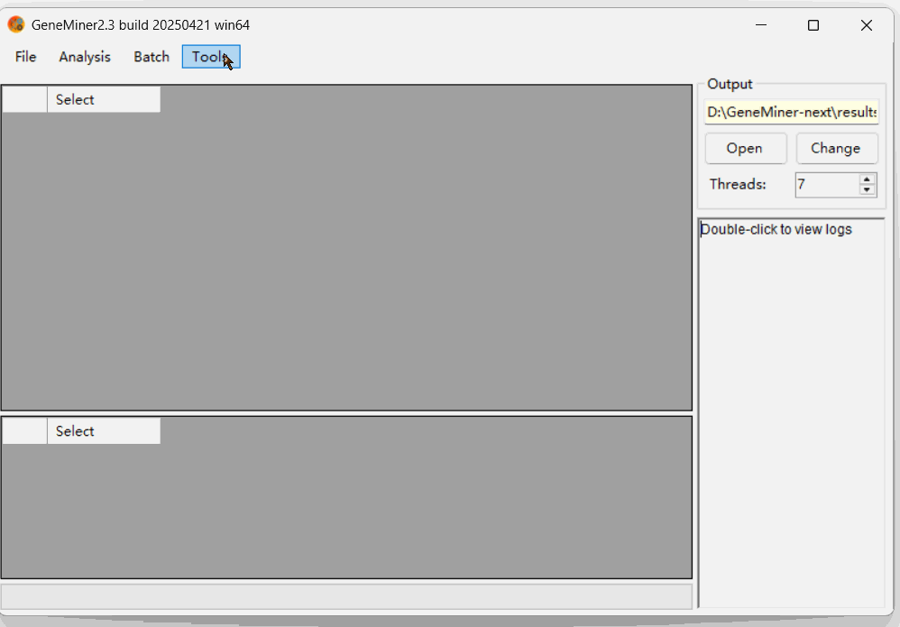
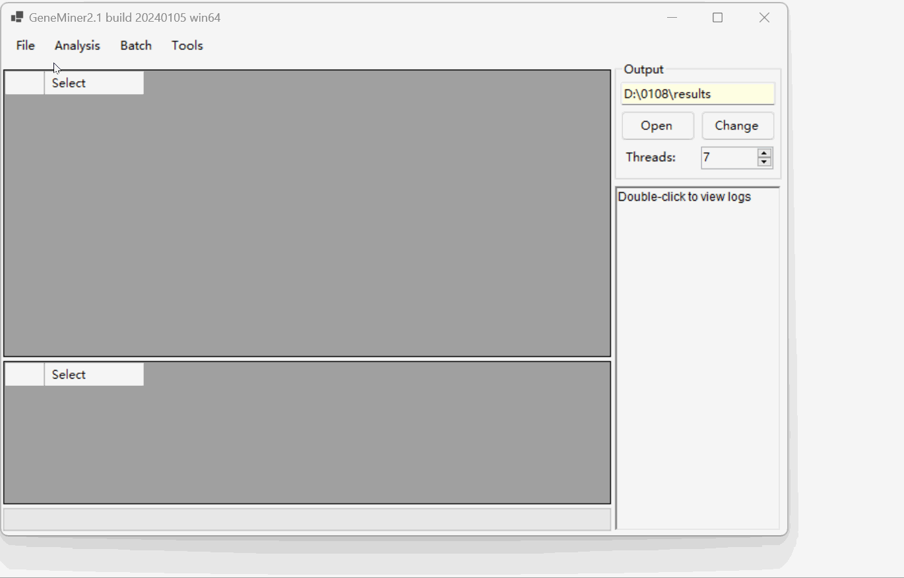

# Tutorial 1 - A Quick Tutorial For General Use

### Loading the data files

- **[Sequencing Data](DATA/seq/)**: Click [**File>Load Sequencing Files**] select sequencing data in .gz or .fq format.
  (For batch processing with **multiple samples**, see **Demo 3** for details.)

- **[Reference Sequence](DATA/A_lyrata/)**: Click [File>Load Reference] select  fasta format reference sequences in fasta or genbank format. 

If no reference file is available locally, you can download standard references by selecting **[Files > Download References >]** from the top menu. Available datasets include:

        •	Plant Chloroplast Genome
        •	Plant Mitochondrial Genome
        •	Animal Mitochondrial Genome
        (Note:Select Download as single gene if you want to e(Note:Select Download as single gene if you want to extract genes.)
        •	Angiosperm 353 Genes

### Calculate parameters

Click [Tools > Calculate Parameters] .

Click **Calculate** to estimate , and then click **Apply** to finalize the settings.

### Obtain Genes

Click [Analysis > Filter & Assemble] to obtain Genes.

**NOTE:** Do not manually close the command line window; it will close automatically once the process is complete.

NOTE: For importing multiple pairs of sequencing files, select [Batch > Filter & Assemble] to extract.

Click [Open] to view the  results located in the 'results' folder.

### Data Cleaning

Click [Analysis > Trim With Reference].

**NOTE:** Parameters was calculate by "Calculate Parameters".

NOTE: For importing multiple pairs of sequencing files, select [Batch > Filter & Assemble] to extract.

Click [Open] to view the  results located in the 'results' folder.