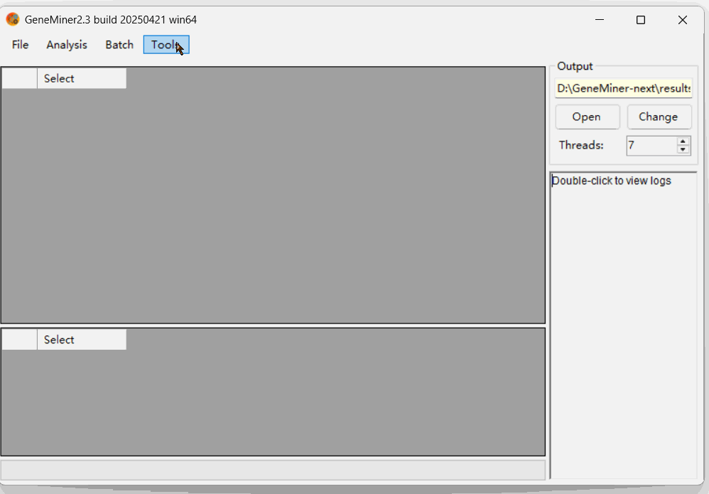
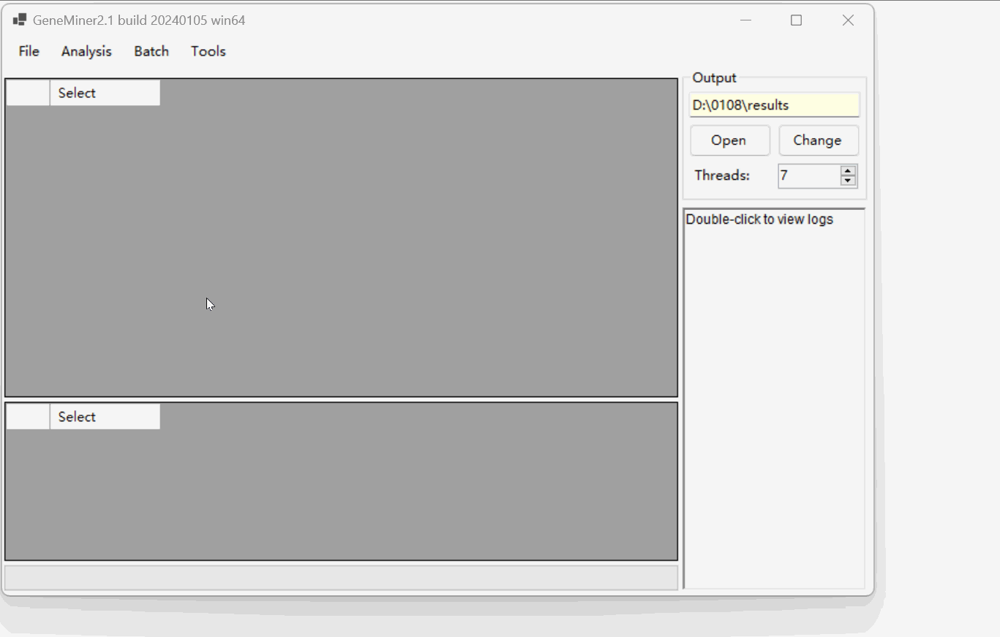
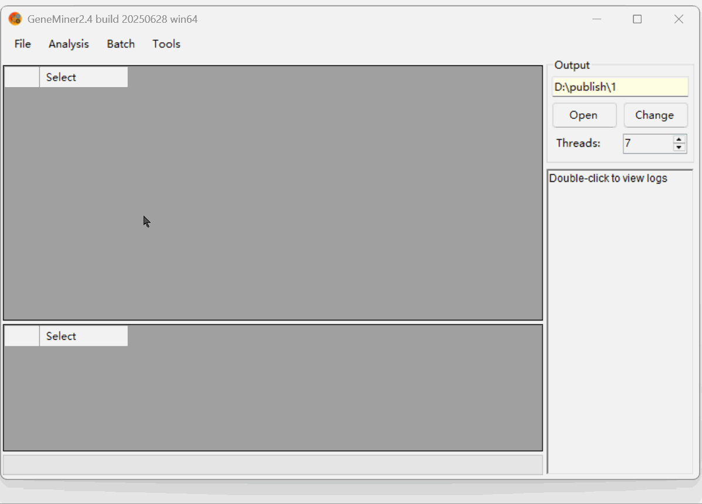
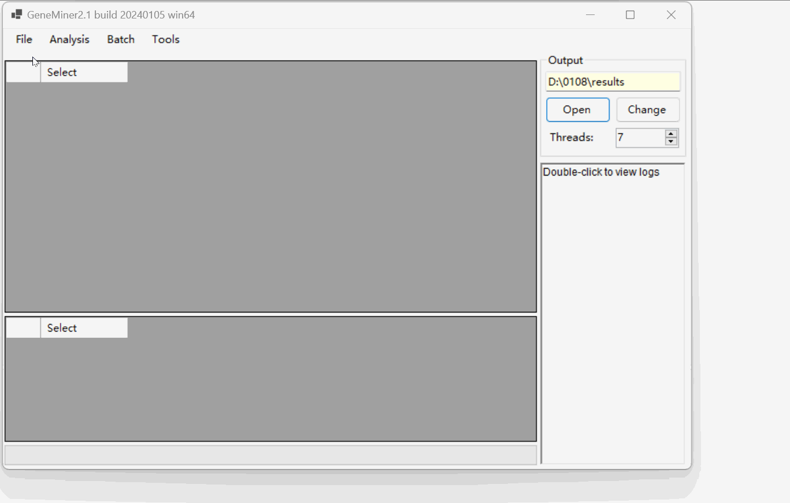

# Tutorial 2 - Obtain Organelle Genes (Genome)

---
## Genes

### Loading the data files

- **[Sequencing Data](DATA/PLANT/GENE/)**: Click [**File>Load Sequencing Files**] select sequencing data in .gz or .fq format.

- **[Reference Sequence](DATA/ref/OK166971.gb)**: Reference gene sequences from closely related species in fasta or genbank format. Click [**File>Load Reference**] select  genbank format reference sequence file. 

If no reference file is available locally, you can download standard references by selecting **[Files > Download References >]** from the top menu. Available datasets include:

        •	Plant Chloroplast Genome
        •	Plant Mitochondrial Genome
        •	Animal Mitochondrial Genome
        (Note:Select Download as single gene if you want to extract genes.)
        
### Calculating Parameters

Click [Tools > Calculate Parameters] .

Click **Calculate** to estimate , and then click **Apply** to finalize the settings.**This demo uses the default parameters.**

### Obtaining Genes

Click [Analysis > Filter & Assemble] to obtain Genes.

**NOTE:** Do not manually close the command line window; it will close automatically once the process is complete.

NOTE: For importing **multiple** pairs of sequencing files, select [**Batch** > Filter & Assemble] to extract.

Click [Open] to access the  results located in the 'results' folder.

---

## Genomes

### Loading the data files

- **[Sequencing Data](DATA/PLANT/GENOME/)**: Click [**File>Load Sequencing Files**] select sequencing data file.

### Obtaining Plant Chloroplast Genome

Click [Analyse>Plant Chloroplast Genome] to download the reference genome of closely related species.

Click [OK] proceed with the default parameters for assembly.

**Note: Insufficient memory may cause assembly failure. If this occurs, consider increasing the memory.**

NOTE: For importing multiple pairs of sequencing files, select [Batch > Plant Chloroplast Genome] to extract.
**"Reads/File (M)" is set to 10.**

Click [Open] to view the  results located in the 'Organelle' folder named "Gennome_cp.fasta".

### Obtaining Plant Mitochondrial Genome

Follow the same process as the Plant Chloroplast Genome assembly. However, initially **import the results of the previous Plant Chloroplast Genome** assembly.

Click [Analyse>Plant Mitochondrial Genome] to download the reference genome of closely related species.

Click [OK] proceed with the default parameters for assembly.

Click [Open] to view the  results located in the 'Organelle' folder named "Gennome_mito_plant.fasta"

---

