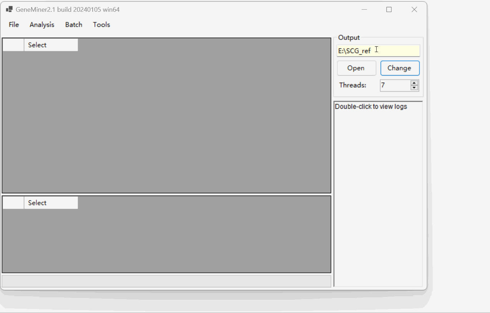
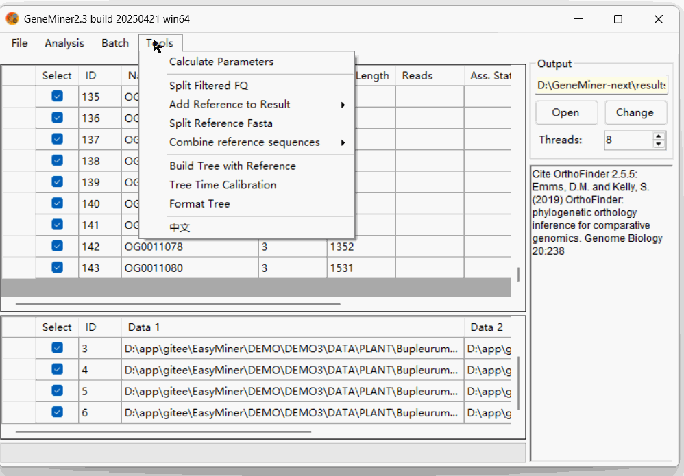
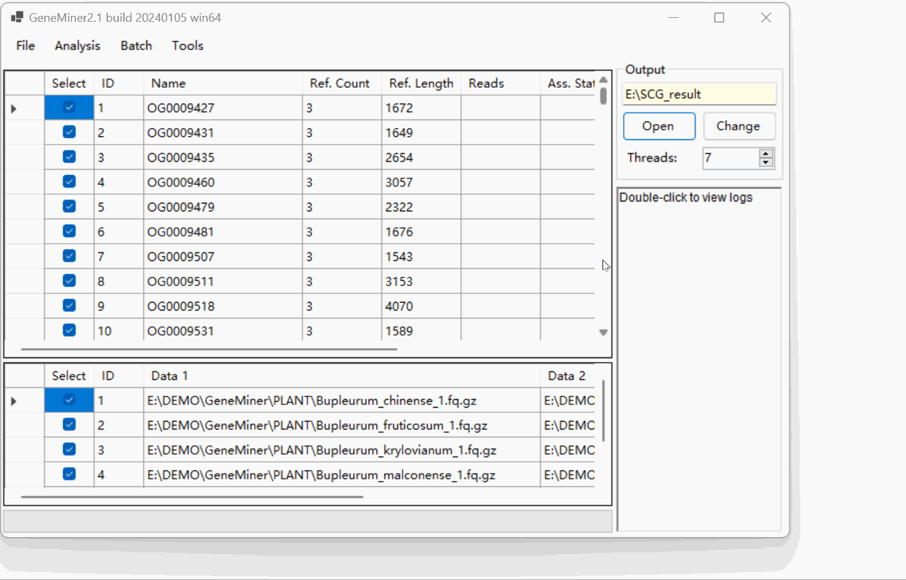
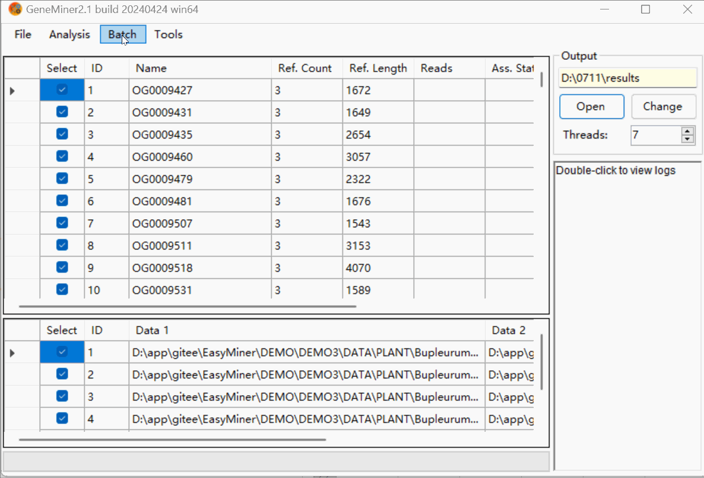
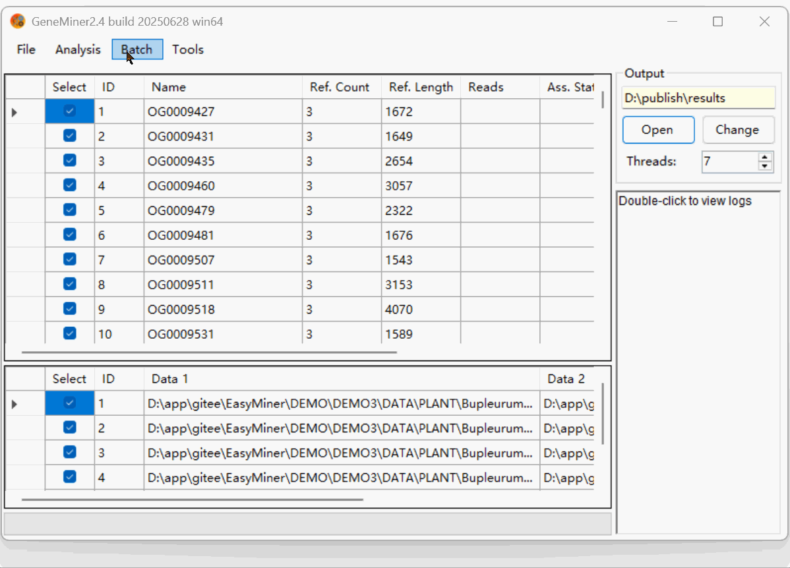

# Tutorial 3 - Single-Copy Gene Workflow(Batch Example)

### Data Preparation

- **[Sequencing Data](DATA/PLANT)**: Second-generation sequencing data files, in .gz or .fq format.

- **[Transcript Data](DATA/Phytozome/)**: Assembled transcript data from a closely related species, obtained post-transcriptome assembly, in .fa format.

These transcripts will serve as the basis for identifying single-copy gene candidates.

### Obtaining Single Copy Genes Reference Sequences

Click [**File > Load References**] select all **Transcript Data** .

Click [**Analysis > Find Single Copy Genes**]  to scan the transcript reference and extract genes present as a single ortholog across the dataset.

These SCGs(in folder:**OrthoFinder>Single_Copy_Orthologue_Sequences**) will serve as the working reference for downstream extraction.

**Make sure to modify the output directory, and avoid using Chinese characters in the path.**

### Calculating Parameters

**This demo uses the default parameters.This part is for demonstration purposes only.**
Click [Tools > Calculate Parameters] .

Click **Calculate** to estimate , and then click **Apply** to finalize the settings.

### Obtaining Single Copy Genes

Click [Change] to modify the folder for results.

Click [**File > Load References**] select the SCG ((in folder:**OrthoFinder>Single_Copy_Orthologue_Sequences**)) reference you have obtained.

Click [**File > Load Sequencing Files**] to import **Sequencing Data** in batch

Click [**Batch > Filter & Assemble**] to obtain Single Copy Genes.

**NOTE:** Do not manually close the command line window; it will close automatically once the process is complete.

NOTE: When importing a pair of sequencing files, click [Analyse > Filter & Assemble] to obtain Single-Copy Genes.

Click [Open] to view the SCG (Single-Copy Gene) results located in the 'results' folder under the sequence name directory.

### Trim low-quality regions

Click [**Batch > Trim With Reference**] to remove low-quality regions and sequences.

[**Retention Length Threshold**] can be adjusted based on the data source to prevent over-filtering.

Trimmed results can be previewed in the BLAST/ directory.本次demo不进行此步骤，仅做示例 。

### Combine aligned sequences

Click [**Batch > Combine Results**] to merge and filter aligned genes across samples (Parameters were set using the Calculate Parameters function).

Concatenated gene alignments are saved as:
    **combined_results.fasta**: All aligned SCGs.
    **combined_trimmed.fasta**: SCGs after quality trimming.
The coalescented results are stored in **combined_results** and **combined_trimed**.

### Building Phylogenetic Tree

Click [**Batch > Build Phylogenetic Tree**]. 

Select the matrix type and tree-building method, enable bootstrap. Choose whether to build a rooted tree, specify the outgroup, and decide whether to perform tree time calibration. 

The **output** file include Coalescent.tree and Concatenation.tree.

### Tree time calibration

Double-click a branch in the tree to edit its divergence time.
