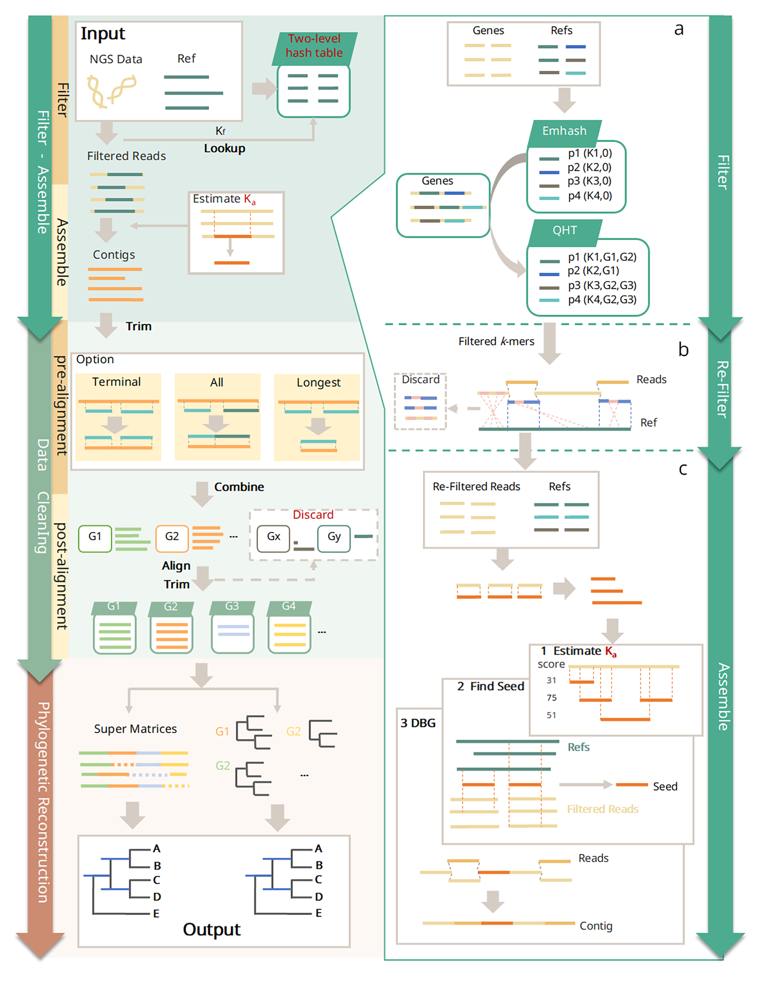
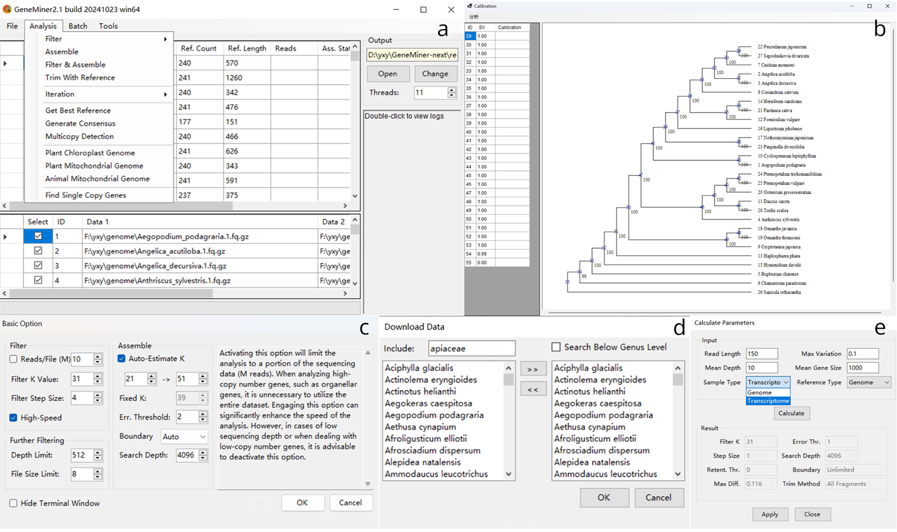

# GeneMiner2: A Comprehensive Toolkit for Phylogenomic Genomics
**[查看中文版的使用说明](README_zh_cn.md)**

# Introduction

GeneMiner2 is a comprehensive toolkit designed for phylogenomic genomics. Its main functionalities include:
- Mining single-copy nuclear genes, plastid genes/genomes, and other molecular markers from next-generation sequencing data.
- Aligning and trimming multiple molecular markers, constructing concatenated and coalescent-based phylogenetic trees, and calibrating tree time.
- Identifying paralogs/multicopy genes.

Users can complete all tasks from obtaining NGS data to establishing phylogenetic trees within GeneMiner2.





For the **complete user manual**, please refer to [manual](manual/manual_geneminer.pdf)

# Citations

Primary reference for GeneMiner2:
Yu XY, Tang ZZ, Zhang Z, Song YX, He H, Shi Y, Hou JQ, Yu Y. 2026. GeneMiner2: Accurate and automated recovery of genes from genome-skimming data. Molecular Ecology Resources 26: e70111.
https://doi.org/10.1111/1755-0998.70111

Related earlier work also welcome for citation:
Zhang Z, Xie PL, Guo YL, Zhou WB, Liu EY, Yu Y. 2022. Easy353: A tool to get Angiosperms353 genes for phylogenomic research. Molecular Biology and Evolution 39(12): msac261.
https://doi.org/10.1093/molbev/msac261


Xie PL, Guo YL, Teng Y, Zhou WB, Yu Y. 2024. GeneMiner: A tool for extracting phylogenetic markers from next-generation sequencing data. Molecular Ecology Resources 24(3): e13924.
https://doi.org/10.1111/1755-0998.13924

# Installation

**[Download GeneMiner2 from SourceForge](https://sourceforge.net/projects/geneminer/files/)**

## Windows

Please download the latest Windows package (**GeneMiner_win64_XXXXXXXX.zip**) from Sourceforge and unzip into a separate folder. Double-click GeneMiner.exe to launch.

**Note:** Avoid installing the software on a portable drive. Paths must not contain non-ASCII characters.

**On Parallel execution:** Do not run multiple windows in parallel within the same folder. Instead, copy the GeneMiner directory (including **analysis** folder and **GeneMiner.exe**) and run a second instance from the duplicated folder.

## macOS

Please download the latest macOS image (**GeneMiner_macos_XXXXXXXX.dmg**) from Sourceforge and drag-drop GeneMiner.app to the desired location.

GeneMiner is packaged with Wineskin to run on macOS. Please try to use the latest version of macOS. Due to limited conditions, GeneMiner has not been tested on all macOS versions. If you meet an error like "GeneMiner.app is damaged", type this in terminal:
- xattr -cr **/path/to/GeneMiner.app**
- Example: xattr -cr /Applications/GeneMiner.app

It is not recommended to run GeneMiner2 on macOS for large-scale analyses because the efficiency is significantly lower than running on Windows.

## Linux and other \*nix systems

On desktop Linux systems, consider running GeneMiner2 with compatibility tools:

**[Running Windows GUI version on Linux](manual/EN_US/linux_desktop.md)**

On server Linux systems, please download the latest Linux binaries (**GeneMiner_cli_linux_XXXXXXXX.tar.gz**) from Sourceforge. Debian 11 or higher, Ubuntu 20.04 or higher, and AlmaLinux 9 or higher are supported. Please also make sure to install dependencies including libbz2, libgomp and zlib. On Ubuntu, it can be done with the following command.

```bash
sudo apt-get install libbz2 libgomp1 zlib1g
```

**[Usage of the command-line version](manual/EN_US/command_line.md#usage)**

If the precompiled package fails to run, you can compile GeneMiner2 from scratch. You can also use the Python scripts in the `scripts` folder. These scripts offer all the core functionalities of GeneMiner2 and can be deployed on any operating systems.

**[Building the command-line version from scratch](manual/EN_US/command_line.md)**

---

# Tutorials

[Tutorial 1 - A Quick Tutorial For General Use(single sample Example)](/DEMO/DEMO1/DEMO1.md)


[Tutorial 2 - Obtain Organelle Genes (Genome)](/DEMO/DEMO2/DEMO2.md)

  
[Tutorial 3 - Single-Copy Gene Phylogenetic Pipeline(Batch samples Example)](DEMO/DEMO3/DEMO3.md)


# Details


For the complete user manual, please refer to [manual](manual/manual_geneminer.pdf)

For more information about functions and interface，[please see here](manual/EN_US/readme_detailed.md).

For a further explanation of the output directory,  [please see here](manual/EN_US/output.md).


# Questions
[Answer](manual/EN_US/FAQ.md)


# Contact
If you have any questions, suggestions, or comments about GeneMiner, feel free to contact Xinyi_Yu2021@163.com.


