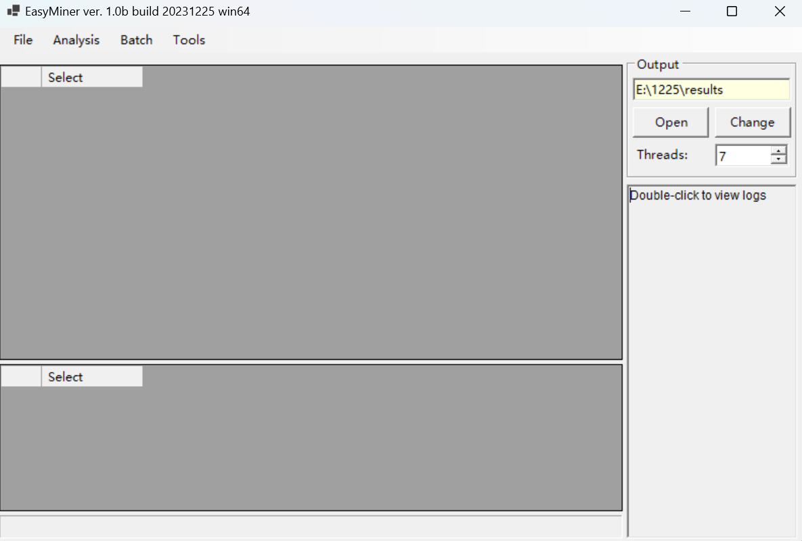

# GeneMiner2: A Comprehensive Toolkit for Phylogenomic Genomics
**[查看中文版的使用说明](README_zh_cn.md)**

# Introduction
 

GeneMiner2 is a comprehensive toolkit designed for phylogenomic genomics. Its main functionalities include:
- Mining single-copy nuclear genes, plastid genes/genomes, and other molecular markers from next-generation sequencing data.
- Aligning and trimming multiple molecular markers, constructing concatenated and coalescent-based phylogenetic trees, and calibrating tree time.
- Identifying paralogs/multicopy genes.

Users can complete all tasks from obtaining NGS data to establishing phylogenetic trees within GeneMiner2.
# Citations
GeneMiner2 is based on our previously developed GeneMiner and Easy353 software and integrates excellent tools such as Blast, Minimap2, Fasttree, Muscle5, Mafft, Astral, PPD, PGA, NOVOPlasty, and OrthoFinder. Please cite the literature prompted by the software when using the corresponding functionalities.

The work on GeneMiner2 has not yet been published. Currently, please cite our paper on GeneMiner:
- Xie PL, Guo YL, Teng Y, Zhou WB, Yu Y. 2024. GeneMiner: A tool for extracting phylogenetic markers from next-generation sequencing data. Molecular Ecology Resources: e13924. [doi:10.1111/1755-0998.13924](https://www.researchgate.net/publication/377298770_GeneMiner_A_tool_for_extracting_phylogenetic_markers_from_next-generation_sequencing_data)

If mining angiosperm 353 genes, please cite our paper on Easy353:
- Zhang Z, Xie PL, Guo YL, Zhou WB, Liu EY, Yu Y. 2022. Easy353: A tool to get Angiosperms353 genes for phylogenomic research. Molecular Biology and Evolution 39(12):[msac261](https://academic.oup.com/mbe/article/39/12/msac261/6862883).

# Install

## Windows and macOS

**[Download GeneMiner2 from SourceForge](https://sourceforge.net/projects/geneminer/files/)**

**Note:** Avoid installing the software on a portable drive.

**For macOS users**: GeneMiner is packaged with Wineskin to run on macOS. Please try to use the latest version of macOS. Due to limited conditions, GeneMiner has not been tested on all macOS versions. If you meet an error like "GeneMiner.app is damaged", type this in terminal:
- xattr -cr **/path/to/GeneMiner.app**
- Example: xattr -cr /Applications/GeneMiner.app

It is not recommended to run GeneMiner2 on macOS for large-scale analyses because the efficiency is significantly lower than running on Windows.

## Linux and other \*nix systems

**[Running on desktop Linux systems](manual/EN_US/linux_desktop.md)**

**[Build instructions on Unix-like platforms](manual/EN_US/command_line.md)**

You can also use the Python scripts in the `scripts` folder. These scripts offer all the core functionalities of GeneMiner2 and can be deployed on Windows, macOS, or Linux.

---

# Tutorials

[Tutorial 1 - A Quick Tutorial For General Use](/DEMO/DEMO1/DEMO1.md)

[Tutorial 2 - For Obtaining Organelle Genes (Genome)](/DEMO/DEMO2/DEMO2.md)

  
[Tutorial 3 - For Obtaining Single Copy Genes](DEMO/DEMO3/DEMO3.md)

[Tutorial 4 - For Obtaining Angiosperms353 Genes](DEMO/DEMO4/DEMO4.md)

# Detailed Description

For detailed GeneMiner2 documentation, [please see here](manual/EN_US/readme_detailed.md).

For a further explanation of the output directory,  [please see here](manual/EN_US/output.md).

# Questions
[Answer](manual/EN_US/FAQ.md)

# Contact
If you have any questions, suggestions, or comments about GeneMiner, feel free to contact Xinyi_Yu2021@163.com.

