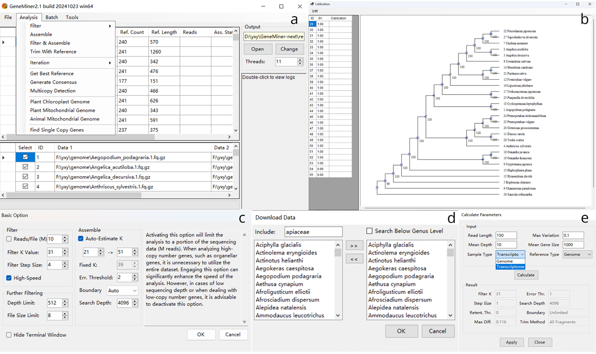

# GeneMiner2: 系统发育基因组学工具包
**[View README in English](README.md)**

# 介绍
GeneMiner2是一款为系统发育基因组学设计的全功能工具包，软件主要功能包括：
- 从二代测序数据中挖掘单拷贝核基因、质体基因等分子标记
- 将多个分子标记切齐、排序、建立串联和溯祖系统发育树
- 拼接注释动植物质体基因组

用户能够在GeneMiner2中完成从NGS数据获取到系统发育树建立的所有工作。




## 引用

欢迎使用并引用GeneMiner2:

Yu XY, Tang ZZ, Zhang Z, Song YX, He H, Shi Y, Hou JQ, Yu Y. 2026. GeneMiner2: Accurate and automated recovery of genes from genome-skimming data. Molecular Ecology Resources 26: e70111.
https://doi.org/10.1111/1755-0998.70111

相关前期分子标记挖掘工具，欢迎引用:

Zhang Z, Xie PL, Guo YL, Zhou WB, Liu EY, Yu Y. 2022. Easy353: A tool to get Angiosperms353 genes for phylogenomic research. Molecular Biology and Evolution 39(12): msac261.
https://doi.org/10.1093/molbev/msac261


Xie PL, Guo YL, Teng Y, Zhou WB, Yu Y. 2024. GeneMiner: A tool for extracting phylogenetic markers from next-generation sequencing data. Molecular Ecology Resources 24(3): e13924.
https://doi.org/10.1111/1755-0998.13924


# 安装和需求

请从下面的地址获取最新的安装包:

**[SourceForge](https://sourceforge.net/projects/geneminer/files/)**

GeneMiner2的源代码在Github和Gitee上均可获取。

## Windows用户

请从上面的Sourceforge地址下载最新的Windows软件包（**GeneMiner_win64_XXXXXXXX.zip**）并解压到一个独立的文件夹中。双击GeneMiner.exe启动图形界面。

**注意:** 请勿在移动磁盘上运行GeneMiner2。请勿将GeneMiner2安装到带有中文的文件夹中。

**关于并行运行:** 不要在同一个文件夹下打开多个窗口并行运行，可以复制GeneMiner所在的文件夹，并在副本文件中运行第二个窗口。文件夹路径不能有中文名。

## macOS用户

请从上面的Sourceforge地址下载最新的macOS安装映像（**GeneMiner_macos_XXXXXXXX.dmg**），并将GeneMiner.app拖放到想要的位置。

如果遇到 "GeneMiner.app已损坏，无法打开"之类的错误，请打开终端，运行类似下面的命令:
- xattr -cr **把GeneMiner.app拖放到此处**
- 例如: xattr -cr /Applications/GeneMiner.app

由于GeneMiner2通过Wine技术运行在macOS上，运行效率远低于Windows，因此不建议用GeneMiner2在macOS上进行大规模的分析。

## Linux和其他\*nix用户

在桌面Linux环境下，请考虑使用兼容性工具运行Windows版本：

**[在Linux上运行Windows版本](manual/ZH_CN/linux_desktop.md)**

在服务器Linux环境下，请从上面的Sourceforge地址下载Linux命令行版本（**GeneMiner_cli_linux_XXXXXXXX.tar.gz**）并解压。这一版本支持Debian 11或以上、Ubuntu 20.04或以上、AlmaLinux 9或以上。此外，请确保你安装了libbz2、libgomp和zlib依赖库。在Ubuntu上，可以用这行命令安装这些依赖：

```bash
sudo apt-get install libbz2 libgomp1 zlib1g
```

**[命令行版本的使用说明](manual/ZH_CN/command_line.md#用法)**

如果预编译的二进制软件包无法运行，您还可以手动编译命令行版本。您也可以直接使用`scripts`文件夹中的脚本，这些脚本提供了GeneMiner2的所有核心功能，可以在任何操作系统上部署。

**[从头编译命令行版本](manual/ZH_CN/command_line.md)**

---

# 示例演示

[Tutorial 1 - 快速掌握使用方法(单个样品)](/DEMO/DEMO1/DEMO1.md)


[Tutorial 2 - 获取质体基因组和质体基因](/DEMO/DEMO2/DEMO2.md)

  
[Tutorial 3 - 单拷贝基因建树流程(批量，多个样品)](DEMO/DEMO3/DEMO3.md)


# 详细说明


详细说明请移步 [manual](manual/manual_geneminer.pdf)

有关软件图形界面和功能的详细说明[请见此处](manual/ZH_CN/readme_detailed.md)

有关输出目录详解[请见此处](manual/ZH_CN/output.md)


# 常见问题
[常见问题解答](manual/ZH_CN/FAQ.md)


# 联系方式
有关GeneMiner任何建议、问题，请联系邮箱
Xinyi_Yu2021@163.com.