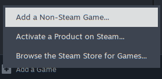
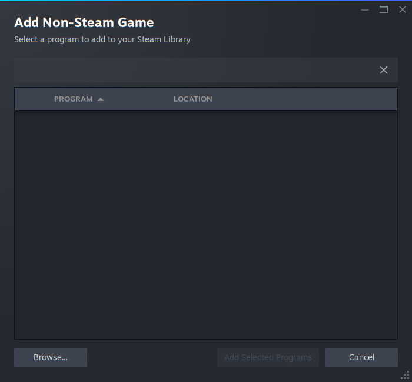
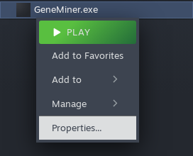
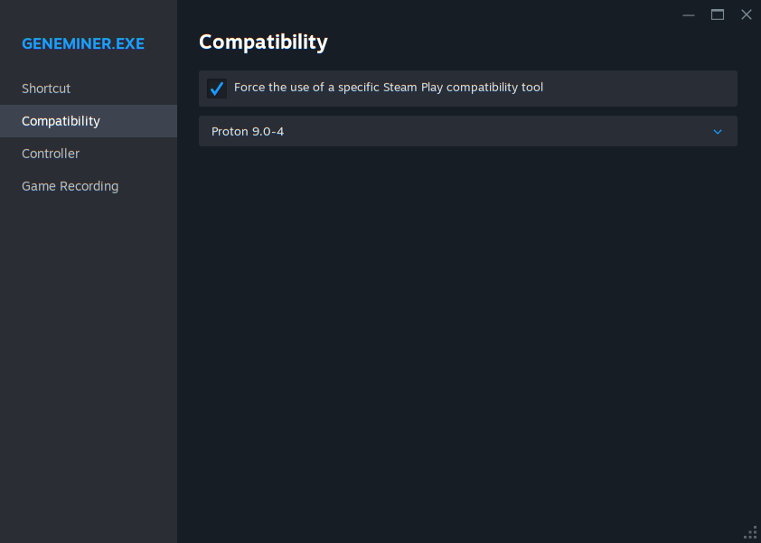

# Running on Desktop Linux Systems

## Methods

We recommend desktop Linux users to run the Windows binaries using a compatibility layer, preferentially Steam Play. On non-desktop Linux systems, or in the case where compatibility tools are not available, [build and run native Linux binaries](command_line.md).

## Motivation

GeneMiner2 is designed to be very friendly to novice users. While we provide a way to build native binaries, the command-line interface lacks several convenience features that facilitate phylogenetic analyses. Therefore, we only recommend native builds for large-scale analysis.

It is known that [Proton](https://github.com/ValveSoftware/Proton) can run GeneMiner2 with good performance. It can be easily installed through [Steam](https://store.steampowered.com/) or [umu-launcher](https://github.com/Open-Wine-Components/umu-launcher). It is also possible to run the Windows binaries using other frontends like [PlayOnLinux](https://www.playonlinux.com/) or just [Wine](https://www.winehq.org/) itself, but more tinkering is required.

## Using Steam

1. Install [Steam](https://store.steampowered.com/) and register a Steam account.

2. Download and unpack the latest Windows package from [Sourceforge](https://sourceforge.net/projects/geneminer/files/).

3. Launch Steam and navigate to your Library. Click "Add a Game" in the left bottom corner, and then select "Add a Non-Steam Game".

    

4. Click "Browse..." in the left bottom corner and choose `GeneMiner.exe`. Click "Add Selected Programs" to add GeneMiner2 to your library.

    

5. Right click the "GeneMiner.exe" entry in the library and select "Properties..." in the menu.

    

6. In the popup window, switch to the "Compatibility" tab. Check "Force the use of a specific Steam Play compatibility tool" and select "Proton 9.0-4" below.

    

7. Click "Play" to launch GeneMiner2. The program should work as if it were running on Windows.

Additionally, you receive the benefit of enraging your Steam friends with a "is now playing GeneMiner2" message each time you run GeneMiner2 with Steam.

## Using umu-launcher

Assuming umu-launcher is properly installed and GeneMiner2 extracted to `~/geneminer2`, running the following line should be able to bring GeneMiner2 up.

```
WINEPREFIX=~/.wine umu-run ~/geneminer2/GeneMiner.exe
```
