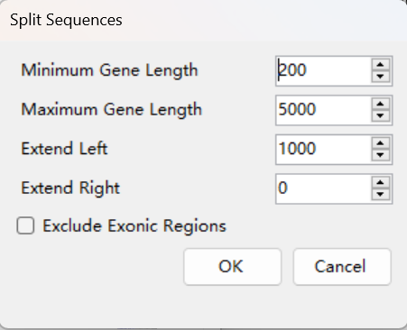
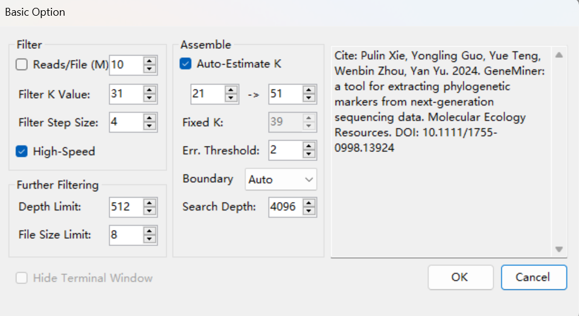
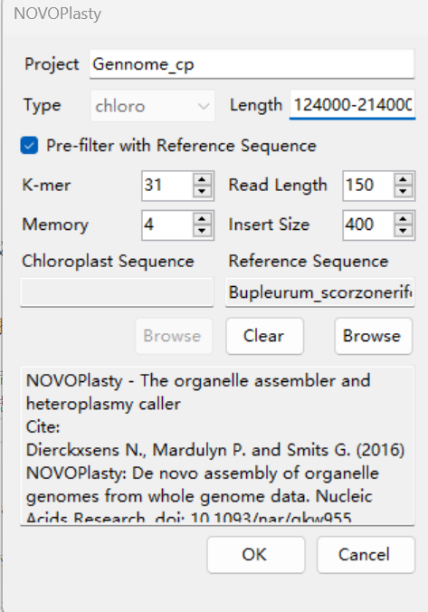
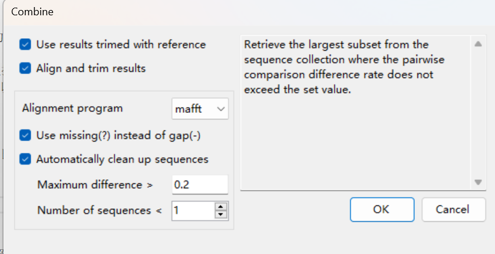
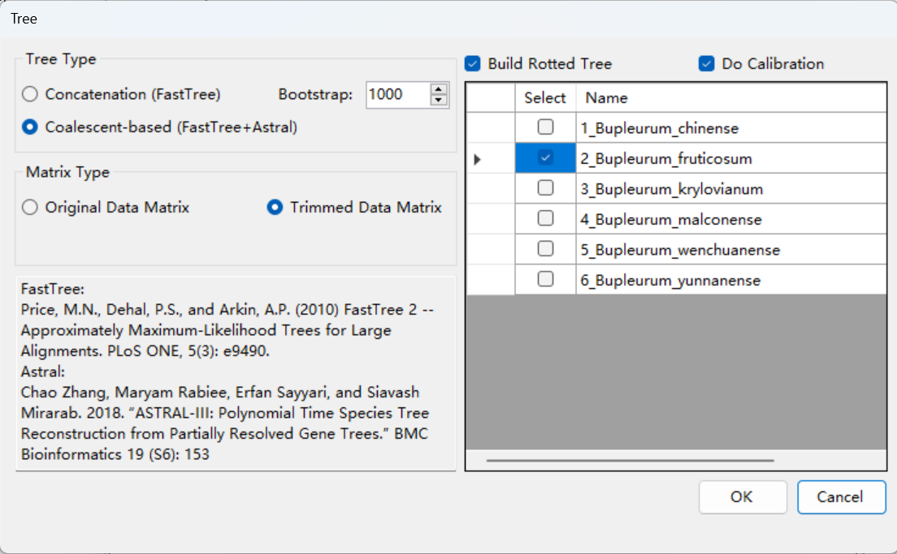

## Graphical interface

### **Sidebar:**

**Output**: The folder for saving results, defaulting to the results folder in the directory where the GeneMiner2 application is located.

**Open**: Opens the output directory in Windows Explorer.

**Change**: Select the folder where results will be saved.

**Note:** The folder for saving results may be repeatedly emptied during operation, so be sure not to choose a folder containing important files. It is recommended to create a new folder for output with each analysis. If the same output folder is selected to continue previous analyses, opt not to clear the folder in subsequent analyses.

**Threads**: The number of threads is set to the total number of logical processors minus two by default. Users can adjust the thread count based on the number of available CPU cores on their machine.

## References Column Descriptions:

- **Select**: Whether to use this reference sequence.

- **ID**: Identifier number of the reference gene.

- **Name**: Name of the reference gene.

- **Ref. Count**: Number of times the reference gene appears.

- **Ref. Length**: Average length of the reference gene (in base pairs).

- **Reads**: Number of reads matching the reference k-mers.

- **Assemble State/Count**: Number of assembled sequences obtained.

- **Ass. Length**: Total length of the assembled sequence.

- **Max. Diff.**: Maximum pairwise divergence between sequences from different species after consensus merging.

- **Assemble State**: Status of sequence assembly, which includes:
  - **no filtered files**: The filtered result file for the gene does not exist.
  - **no reads**: The filtered result file exists, but no usable read fragments could be extracted for assembly.
  - **insufficient genomic kmers**: The number of genomic k-mer regions detected after filtering is insufficient for assembl 
  - **no seed**: No valid seed sequences were identified to initiate assembly. 
  - **no contigs**: No contigs were generated due to insufficient read coverage or failed extension from seeds.
  - **low quality**: Low accuracy of results, reads insufficient to cover assembled results.
  Note: If any of the above filering or assembly failures occur, it is recommended to adjust the reference, k-mer (kf,for filter),the filter step size , or error rate(for assemble).
  - **success**: Assembly successful.

- **Ass. Length**: Length of the assembly result.

- **Max.Diff.**: Maximum divergence obtained from pairwise comparison of genes from different species after [Merge & Trim]. Right-click and select Max. Diff. to filter out low-quality result sequences based on maximum divergence, with a default filter set at 0.1. Once checked, selected sequences can be re-merged and trimmed for phylogenetic tree construction using the filtered and trimmed results.

## Sequences Column Descriptions:

- **Select**: Whether to use this set of data files.

- **Data1**: Left end (end 1) of the sequencing file.

- **Data2**: Right end (end 2) of the sequencing file; if it is single-end sequencing, it automatically matches the content in Data1.

**Note**: The batch function supports sequencing data from multiple samples.

---

## Function Menu

### File:

**[File > Load References]**: Choose reference sequence files in either fasta or genbank format; multiple reference sequence files can be selected at once.

If a genbank format file is selected, you can choose whether to import it as a gene list. If so, GeneMiner2 will automatically decompose the genes according to gene names, and the following settings dialog will pop up:

* Minimum Gene Length: The minimum length of genes to process

* Maximum Gene Length: The maximum length of genes to process

* Extend Left/Right: The length to extend on each side of a gene (the extended intron region length)
  
* Exclude Exonix Region :Exon regions can be removed, retaining only the selected length of the intron regions.

* Note: GeneMiner2 is designed to filter and assemble sequences that include exon regions; it is not recommended to directly import intron regions as reference.

**[File > Load Sequencing Files]**: Load second-generation sequencing data files, which can be in .gz or .fq format. For paired sequence files, select two files (even number) simultaneously to load. If only one file is selected, it will be loaded as single-end sequencing data.

**[File > Download References >  Plant Chloroplast Genome]**  
**[File > Download References >  Plant Mitochondrial Genome]**  
**[File > Download References >  Animal Mitochondrial Genome]**:
Retrieve organelle genomes from the software's local database for reference sequence import. The local database is populated with data from NCBI ([NCBI](https://www.ncbi.nlm.nih.gov/)).

Enter the Latin taxonomic name of the genus or higher taxonomic rank in the input box, select the taxonomic group below, and click the >> button to add it to the list on the right.

**Note**: If the taxonomic group you are researching is not found, this means it is not available in the software's local database; please select a higher taxonomic rank as a substitute.

After downloading, the reference sequence will appear in the reference sequence list and can be used directly for analysis. It is recommended to use **[File > Export References]** to export a backup to avoid repetitive downloads.

- Search Below Genus Level : Only displays taxa related to the genus level. If unchecked, it defaults to showing taxa at the genus level and above. It is recommended to check this option.
- Download as Single Gene: Downloads the entire chloroplast genome sequence in fasta format. If unchecked, it defaults to downloading the entire chloroplast genome in gb format, which will be split into multiple gene reference sequences for import. 

**[File > Download Sequences > Angiosperms 353 Genes]**: Retrieve the Angiosperms353 Gene Set (AGS) from the software's local database for reference sequence import. The local database sources data from the Kew Tree of Life Explorer ([Kew Tree of Life](https://treeoflife.kew.org)).

**[File > Export References]**: Choose an output folder to export the selected reference genes in fasta format.

**[File > Export Sequencing Files]**: Select an export folder, set the number of reads to skip, and the number of reads to preserve (export) in the popup dialog. For each pair of sequencing files, the exported files are named *.1.fq and *.2.fq (* is the sequence name).

**[File > Export List]**: Specify the filename and location to save the reference sequence information list in CSV format.

**Note**: If exporting within the same folder, change the names of previously exported sequences to avoid overwriting them.

**[File > Save Project]**: Save the data imported into the software in .geneminer format.

**[File > Open Project]**: Directly import previously loaded data (including references, result directories, and sequencing sequences).

---

### Analysis:

**[Analysis > Filter > Filter from Scratch]**: Use references to filter sequencing data, obtaining reads associated with target genes. The fq files of filtered results are saved in the 'filtered' folder within the output directory. If the filtering depth is too high or the files are too large, further filtering is recommended. Upon completion, the estimated depth of the filtered results will be displayed on the main interface list, and users can check the size of each gene's filtered file in the 'filtered' folder of the output directory.

**[Analysis > Filter > Further Filter]**: Perform further filtering on data that is too large or too deep in the filtered results. Original data that is too large or too deep is stored in the 'large_files' folder, and data after further filtering is saved in the 'filtered' folder.

**[Analysis > Assemble]**: Perform assembly using the filtered sequences, with the final results saved in the 'results' folder of the output directory.

**[Analysis > Filter & Assemble]**: Automatically complete all steps of filtering, (further filtering), and assembly using the current settings, with all results saved in the output directory.

Parameter settings will appear during the above steps, with specific meanings as follows:

#### **Basic Option:**

##### **Filter:**

    - Reads/File (M): Activating this option will limit the analysis to a portion of the sequencing data (M reads). When analyzing high-copy number genes, such as organellar genes, it is unnecessary to utilize the entire dataset. Engaging this option can significantly enhance the speed of the analysis. However, in cases of low sequencing depth or when dealing with low-copy number genes, it is advisable to deactivate this option.

    - Filter K-value: The Filter K Value (kf) depends on three factors: acquisition rate (p) of gene-specific reads, read length (r), and variation degree (v) between reference and target sequences. Typically, with p at 0.99, r at 150, and v at 0.1, kf is around 31, our default setting. If p is 0.95 and v increases to 0.2 (r stays at 150), kf drops to 17, the proposed minimum threshold.

    - Filter Step Size: Sets the interval of base numbers in the filtering process. Increasing this value can speed up the filtering process but may also reduce the recovery rate of reads. In cases of low sequencing depth or significant differences between the reference and target sequences, it is recommended to reduce this value to 1; otherwise, keep the default setting.

For example, with a filter K-value of 7 and a step size of 1, the segmentation of reads is as follows:

    - High Speed: Enabling this option stores the majority of the data in memory instead of computing it in real-time. This approach can nearly double the processing speed compared to when the option is disabled. However, it is important to note that the RAM usage will also increase substantially, almost doubling in capacity.

##### **Further Filter:**

    - Depth Limit: FWhen the software processes a large amount of filtering data, it initiates a secondary filtering process aimed at enhancing the efficiency and accuracy of sequence assembly. GeneMiner2 increases the filtering K value (kf) by 2 each time when the product of read length and read count divided by the average reference length exceeds this value, with an upper limit of 63.

    - File Size Limit: When the software processes a large amount of filtering data, it initiates a secondary filtering process aimed at enhancing the efficiency and accuracy of sequence assembly. GeneMiner2 increases the filtering K value (kf) by 2 each time when the size of the filtering file exceeds this value (measured in MB), with an upper limit of 63.

##### **Assemble:**

    - [Auto Estimate K]: Sets the starting and terminal value for the automatic estimation process of the assembly K-mer (ka).Recommended check.

    - [Fixed Assembly K-mer Value]: Utilize a fixed assembly K-mer (ka) value for sequence assembly.

    - [Error Threshold]: Within the generated Kmers from reads, only Kmers with a count exceeding this specified value will be used for sequence assembly.
        Note: A higher error threshold improves accuracy. Use the default value if few sequences are recovered.

    - [Boundary]: In GeneMiner2, the soft boundary is the maximum extension outside sequence edges during target sequence recovery. 'Auto' limits this to half the read length. Setting it to '0' disables it, while 'Unlimited' imposes no boundary length restriction.

    - [Search Depth]: This option specifies the maximum number of distinct candidate sequences retained during assembly, which typically requires no modification. For target sequences exceeding 5k in length, a higher value may be set.

**[Analysis > Trim With Referece]**: 
    - [Trim Terminal]:Trims and joins both ends of matched reference regions to generate high-quality assemblies.Recommended when the reference and sequencing data are from the same source with high sequencing depth.
    - [All Fragments]:Uses all matched reference fragments for alignment and trimming.Suitable for low coverage datasets needing more and longer sequences.Recommended when the reference and sequencing data are from different sources.
    - [Longest Fragments]:Retains only the longest matched region for each reference fragment.Suitable for genomes with paralogs or transcriptomes with alternative splicing.

**[Analysis > Iteration > First Iteration]**: Use the sequences in `contigs_all` from the output directory as the reference sequence, and re-execute all filtering and assembly processes. The results are saved in the `iteration` folder in the output directory. Running this can enhance the length and accuracy of the sequences.

**[Analysis > Iteration > Cover with Iteration]**: Replace the result files in `results` with the post-iteration result files.

**[Analysis > Iteration > Multiply Iteration]**: Perform multiple iterations to enhance the length and accuracy of the sequences.

**[Analysis > Get Best Reference]**：The reference with the highest number of matching kmers is selected as the best reference sequence.

**[Analysis > Generate Consensus]**: Map the result sequences to the filtered fq files. Set the threshold according to the prompts; increasing the threshold will increase the number of ambiguous bases. If you want to differentiate mixed sequences, it is recommended to choose the default (0.75), and if you want results without degenerate bases, it is recommended to choose 0.25.

**[Analysis > MultiCopy Detection]**: Detect multi-copy genes, which are stored in the "multicopy" file.

**[Analysis > Plant Chloroplast Genome]**: GeneMiner2 uses NOVOPlasty for organelle genome assembly. The software provides downloadable chloroplast genome sequences of closely related species as reference sequences and selects a closely related one as the seed sequence, which can resolve issues with inverted repeats in chloroplast regions. After loading the data file, the chloroplast genome assembly can begin. Typically, the default parameters are sufficient. For more detailed default settings, manually edit the `NOVO_config.txt` file in the `analysis` directory of the application package. Be careful not to delete content between $ symbols. Click the confirm button to start, and all results will be saved in the `Organelle` folder in the output directory.

**[Analysis > Plant Mitochondrial Genome]**: GeneMiner2 uses NOVOPlasty for organelle genome assembly. **Previously assembled chloroplast genomes must be selected**, then load the data file to begin the mitochondrial genome assembly. The software provides downloadable mitochondrial genome sequences of closely related species as reference sequences. 

**[Analysis > Animal Mitochondrial Genome]**: GeneMiner2 uses NOVOPlasty for organelle genome assembly. 

NOVOPlasty settings can be adjusted based on computer configuration to increase the allowable maximum memory for enhanced speed. For detailed explanations of the parameters, see [NOVOPlasty Github](https://github.com/ndierckx/NOVOPlasty).

**[Analysis > Find Single Copy Genes]**: Transcript data needs to be imported as the reference sequence, and single-copy genes are extracted from the imported transcripts, which will subsequently be used as references.

---

### Batch
**[Batch > Filter]**: Use references to filter sequencing data in batch, obtaining reads associated with target genes. 

**[Batch > Filter & Assemble]**: Perform batch analysis on selected sequencing files from different species, automatically completing all steps of filtering, (further filtering), and assembly using the current settings. All results are saved in the output directory named after the sequencing file names.**Details see in **Analysis** part.**

**[Batch > Re-Assemble]**: Perform batch analysis on selected sequencing files from different species, reassembling using the current settings.

**[Batch > Trim With Referece]**: Use BLAST to trim low-quality sequences at both ends based on the source of the reference sequence and filter the sequences according to set thresholds. When the sequencing and reference sequence sources differ (for example, using genomic data with a transcriptome reference), it is recommended to set this value to 0 to prevent over-filtering. When the sources are the same, the default value of 50% is recommended. The trimmed results are saved in the 'blast' folder.

**[Batch > Combine Results]**: Merge the results of batch analyses and perform multiple sequence alignment and trimming on the merged fasta file.

**[Batch > Build Phylogenetic Tree]**: Construct a phylogenetic tree based on merged results. Concatenated/coalescent-based trees can be chosen for construction, and rooted trees can be supported with the selection of an outgroup.

**[Batch > Generate Consensus]**: Map the filtered fq files of selected species in batch to the result sequences. Set the threshold according to prompts; increasing the threshold will result in a higher number of ambiguous bases.

For specific values for threshold settings, see **[Analysis Menu]**.

**[Batch > Multi-Copy Detection]**: Perform multi-copy gene detection on the extracted result sequences for each species.

**[Batch > Paralogous Detection (PPD)]**: **Note, PPD can only be performed after Consensus Reconstruction**, i.e., after paralogous parity detection on the results extracted from [Filter & Assemble]. An outgroup sequencing file ID number is required.

**[Batch >Plant Chloroplast Genomes]**: Perform batch chloroplast genome assembly on selected sequencing files from different plant species.

**[Batch > Plant Mitochondrial Genomes]**: Perform batch mitochondrial genome assembly on selected sequencing files from different plant species.To assemble the plant mitochondrial genome, itis necessary to already
possess the chloroplast genome first.

**[Batch > Animal Mitochondrial Genomes]**: Perform batch mitochondrial genome assembly on selected sequencing files from different animal species.

Details in **[Analysis]**.

**[Batch > Summary Stastistics]**: Compile the results of filtering, assembly, consensus reconstruction, and paralogous parity analysis.Explanation for summary.csv can be found in [output.md].

---

### Tools
**[Calculate Parameters]**: Use references to filter sequencing data in batch, obtaining reads associated with target genes. 

**[Split Filtered FQ]**:Split the filtered file into paired-end reads; results are saved in the filtered folder.

**[Combine reference sequences]**:Merge by species or files directly.

**[Add Reference to Result]**:Align assembled sequences with the reference. Results are saved in the aligned or trimmed folder. You can choose to trim terminal or the entire sequence.

**[Split Reference Fasta]**:Select the reference sequences you wish to slice. GeneMiner2 will slice the reference into overlapping fragments to improve alignment flexibility and sensitivity.Enter the length of the input slice and the overlap length, separated by ':'.
For example:300,150 means that each reference fragment will be 300 base pairs long, and adjacent fragments will overlap by 150 base pairs. Sliced sequences will be directly imported as reference. To save them, use “File → Export Reference” to export to a specified folder.

**When is slicing useful?**
The sample and reference differ significantly (e.g., different species or varieties)
The reference is a transcript or contains introns
Sequencing depth is low and matched regions are sparse or fragmented

**[Build Tree with Reference]**:Construct a phylogenetic tree based on the imported reference sequences.

**[Tree Time Calibration]**:Perform divergence time calibration on a specified tree file.

**[Format Tree]**:Standardize species names in the imported tree.

**[中文]**:Change language to Chinese.

## References
ZHANG Z, XIE P, GUO Y, et al. Easy353: A Tool to Get Angiosperms353 Genes for Phylogenomic Research [J]. Mol Biol Evol, 2022, 39(12).

XIE P, GUO Y, TENG Y, et al. GeneMiner: A tool for extracting phylogenetic markers from next-generation sequencing data [J]. Mol Ecol Resour, 2024, 24(3): e13924.

LIU C, TANG Z, LI L, et al. Enhancing antimicrobial resistance detection with MetaGeneMiner: Targeted gene extraction from metagenomes [J]. Chin Med J (Engl), 2024, 137(17): 2092-8.

DIERCKXSENS N, MARDULYN P, SMITS G. NOVOPlasty: de novo assembly of organelle genomes from whole genome data [J]. Nucleic Acids Res, 2017, 45(4): e18.

Wenbin Z,John S,Jenny Q X. A New Pipeline for Removing Paralogs in Target Enrichment Data.[J]. Systematic biology,2021,71(2).

KATOH K, MISAWA K, KUMA K I, et al. MAFFT: a novel method for rapid multiple sequence alignment based on fast Fourier transform [J]. 2002, 30(14): 3059-66.

EDGAR R C J N C. Muscle5: High-accuracy alignment ensembles enable unbiased assessments of sequence homology and phylogeny [J]. 2022, 13(1): 6968.

CAPELLA-GUTIERREZ S, SILLA-MARTINEZ J M, GABALDON T. trimAl: a tool for automated alignment trimming in large-scale phylogenetic analyses [J]. Bioinformatics, 2009, 25(15): 1972-3.

PRICE M N, DEHAL P S, ARKIN A P. FastTree 2--approximately maximum-likelihood trees for large alignments [J]. PLoS One, 2010, 5(3): e9490.

NGUYEN L T, SCHMIDT H A, VON HAESELER A, et al. IQ-TREE: a fast and effective stochastic algorithm for estimating maximum-likelihood phylogenies [J]. Mol Biol Evol, 2015, 32(1): 268-74.

ZHANG C, RABIEE M, SAYYARI E, et al. ASTRAL-III: polynomial time species tree reconstruction from partially resolved gene trees [J]. BMC Bioinformatics, 2018, 19(Suppl 6): 153.

YANG Z, RANNALA B J M B, EVOLUTION. Bayesian estimation of species divergence times under a molecular clock using multiple fossil calibrations with soft bounds [J]. 2006, 23(1): 212-26.

RANNALA B, YANG Z J S B. Inferring speciation times under an episodic molecular clock [J]. 2007, 56(3): 453-66.

EMMS D M, KELLY S. OrthoFinder: phylogenetic orthology inference for comparative genomics [J]. Genome Biol, 2019, 20(1): 238.
