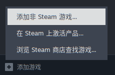
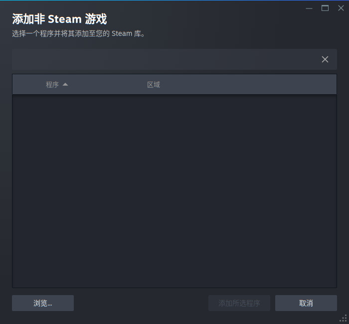
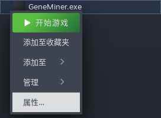
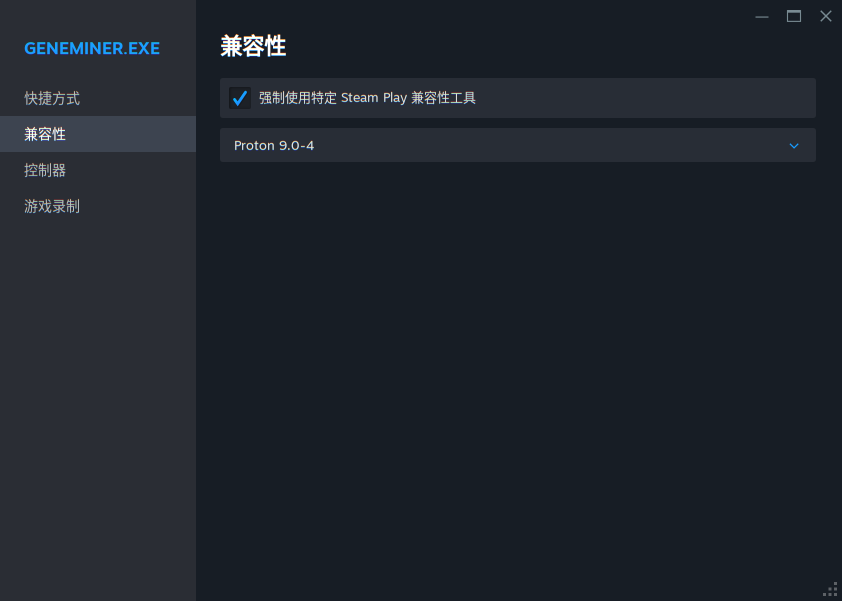

# 在桌面Linux系统上运行GeneMiner2

## 方法

我们推荐桌面Linux用户通过兼容层（建议使用Steam Play）运行Windows版GeneMiner2。在服务器Linux系统上，或者在无法使用兼容性工具的场合，请[手动编译运行原生Linux版本](command_line.md)。

## 动机

GeneMiner2 致力于为初学者提供友好的使用体验。GeneMiner2的原生命令行版本缺少一些简化系统发育分析的功能，所以我们只推荐将命令行版本用于大规模分析。

[Proton](https://github.com/ValveSoftware/Proton)能够完全兼容GeneMiner2，并且性能较好。用[Steam](https://store.steampowered.com/)或者[umu-launcher](https://github.com/Open-Wine-Components/umu-launcher)可以简便地安装Proton。GeneMiner2也可以用[PlayOnLinux](https://www.playonlinux.com/)等其他Wine前端运行，或直接使用[Wine](https://www.winehq.org/)本体运行，但是需要更多的额外配置工作。

## 使用Steam

1. 安装[Steam](https://store.steampowered.com/)并注册账号。

2. 从[Sourceforge](https://sourceforge.net/projects/geneminer/files/)下载最新的Windows版本并解压。

3. 打开Steam，选择库。点击左下角的“添加游戏”，选择“添加非 Steam 游戏...”。

    

4. 点击左下角的“浏览...”，选择`GeneMiner.exe`。点击“添加所选程序”把GeneMiner2添加到库。

    

5. 右键点击刚添加的"GeneMiner.exe"，选择菜单的“属性...”。

    

6. 在弹出窗口中，切换到“兼容性"，勾选“强制使用特定 Steam Play 兼容性工具”，在下面的下拉框选择“Proton 9.0-4”。

    

7. 点击“开始游戏”运行GeneMiner2。

另外，通过Steam打开GeneMiner2的时候，可以给Steam好友发一条“正在玩 GeneMiner2”消息，从而促进友情的结束。

## 使用umu-launcher

假设GeneMiner2已经解压到`~/geneminer2`，可以运行这行命令启动GeneMiner2。

```
WINEPREFIX=~/.wine umu-run ~/geneminer2/GeneMiner.exe
```
