## 图形界面

### **侧边栏：**

**输出目录**: 保存结果的文件夹，默认为GeneMiner应用程序所在目录的results文件夹。

**打开目录**: 在Windows资源管理器中打开输出目录。

**更改目录**: 选择保存结果的文件夹。
**注意:** 保存结果的文件夹在运行过程中可能被反复清空，请务必不要选取保存有资料的文件夹。建议每次分析都新建文件夹进行输出。如果为了延续之前的分析而选取同样输出文件夹，请在后续的分析中选择不清空文件夹。

**进程数量**：最大值为电脑逻辑处理器减二。可自行根据个人电脑内核决定进程数量。

### 参考序列列表：

- Select: 是否使用该条参考序列。

- ID: 参考基因的编号。

- Name: 参考基因的名称。

- Ref. Count: 参考基因的数量。

- Ref. Length: 参考基因的平均长度(bp)。

- Reads: 匹配kmer的reads数量。

- Assemble State/Count：
  - no filtered files：未找到该基因的过滤结果文件。
  - no reads：过滤结果文件存在，但未能提取出可用于组装的有效 reads 片段。
  - insufficient genomic kmers：过滤后获得的基因组 k-mer 区段数量不足，无法进行组装。
  - no seed：未能识别出可用于启动组装的有效种子序列。
  - no contigs：由于 reads 覆盖不足或拼接失败，未能生成任何 contig。
  - low quality：虽已完成组装，但结果准确性较低，reads 无法有效覆盖拼接区域。
  - 备注：如出现以上任何过滤或组装失败情况，建议尝试调整参考序列、k-mer 过滤长度（kf）或过滤步长参数。
  - success：组装成功。

- Ass. Length: 拼接结果的长度。

- Max.Diff.: 进行[合并序列]后不同物种基因两两比对得到的最大差异度。

---

### 测序序列列表：

Select: 是否使用该组数据文件

Data1: 测序文件的左端(1端)

Data2: 测序文件的右端(2端)，如果是单端测序，则自动与Data1中的内容相同。

**注意:批量功能针对多个样品。**

---

## 功能菜单

###  文件菜单：

**[文件>载入参考序列]** :选择fasta或者genbank格式的参考序列文件，可以一次选择多个参考序列文件。

在打开对话框中，右下角可以切换待选取的数据类型:

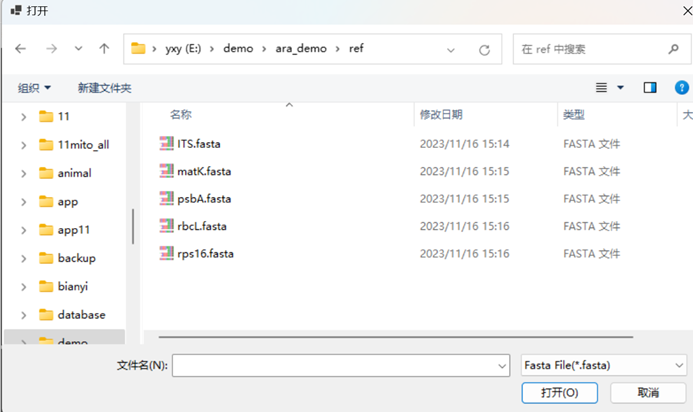

如果选择了genbank格式的文件，可以选择是否作为基因列表导入，如果选是，GeneMiner会对其中的基因按照基因名自动分解，会弹出如下设置对话框: 

 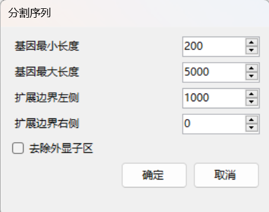

* 基因最小长度：要处理的基因的最小长度

* 基因最大长度：要处理的基因的最大长度

* 扩展边界左侧/右侧：在每个基因两侧延展的长度（扩展的内含子区长度）
  
* 可以勾选去除外显子区，只保留选取长度的内含子区。
  
* 注意：GeneMiner2只可以对含外显子区的序列进行过滤组装，不建议直接导入内含子区作为参考序列组装。

**[文件>载入测序文件]** :载入二代测序的数据文件，文件格式为.gz或.fq。对于配对(paired)的序列文件，需要同时选中两个（偶数个）数据文件一起载入，如只选取一个，则会作为单端测序数据载入。

**[文件>下载参考序列>下载植物叶绿体基因组]  [文件>下载参考序列>下载植物线粒体基因组]** **[文件>下载参考序列>下载动物线粒体基因组]**：：

从软件本地数据库获取细胞器基因组作为参考序列导入。本地数据库从NCBI（https://www.ncbi.nlm.nih.gov/）获取数据。

 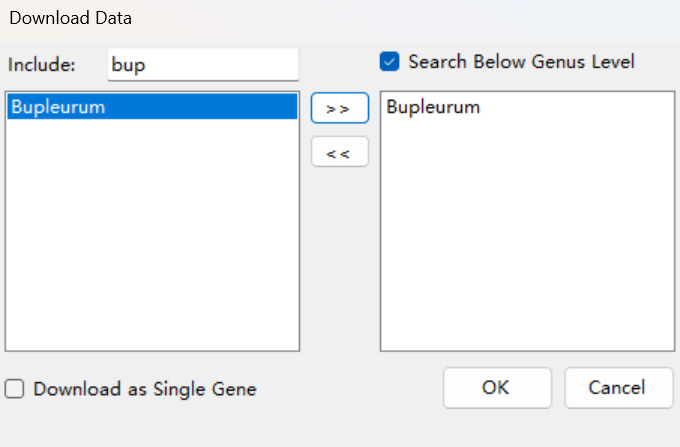

在输入框中输入属或以上分类阶元的拉丁学名，在下方选中类群，点击>>按钮添加到右侧列表中。

**注意：如果找不到您所研究的类群，这意味着该类群在NCBI数据库没有数据，请选择更高分类阶元的类群代替。**

下载完成后会在参考序列列表中显示，可直接作为参考序列分析。建议使用[文件>导出参考序列]导出备用，以免重复下载。

* 不在属以上搜索：仅显示属级相关分类阶元。不勾选默认显示属级及以上分类阶元。建议勾选。

* 作为单个基因下载：将下载fasta格式的叶绿体全基因组序列。不勾选默认下载gb格式的叶绿体全基因组序列，将分割为多条基因参考序列导入。

**[文件>下载参考序列>被子植物353基因]**：从软件本地数据库获取Angiosperms353 Gene Set (AGS)作为参考序列导入。本地数据库从Kew Tree of Life Explorer (https://treeoflife.kew.org)获取数据。

**[文件>导出参考序列]** 选择输出文件夹，将选取的参考基因导出为fasta格式。

**[文件>导出测序文件]** 选择导出文件夹，在弹出的对话框中设定要跳过的读长的数量，并设置保留的（导出的）读长数量。对于每一对测序文件，导出的文件以*.1.fq和*.2.fq(*为序列名)命名。

**[文件>导出列表信息]** 指定要保存的文件名及文件位置，将参考序列信息列表保存为csv格式。

**注意：如果在同一文件夹中导出，需要更改先前已经导出的序列名，否则将会被覆盖。**

**[文件>保存项目文件]**: 将软件内已导入的数据存为.geneminer格式。选择

**[文件>载入项目文件]**：可以直接导入之前已加载的数据(包括参考序列、结果目录、测序序列)。

---

### 分析菜单:

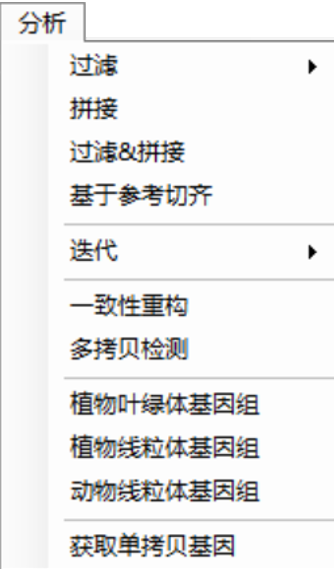

**[分析>过滤>从头过滤]**: 使用参考基因对测序数据进行批量过滤，获得与目标基因关联的reads。过滤结果的fq文件保存在输出目录中的filtered文件夹中。如果过滤深度过高或文件过大，则建议进行进一步过滤。运行结束后，会在主界面列表中显示过滤结果的估算深度，用户可以在输出目录的filtered文件夹中查看每个基因过滤文件的大小。

**[分析>过滤>进一步过滤]**: 对过滤结果中过大或深度过深的数据进行进一步过滤，过大或深度过深的原始数据会储存在large_files文件夹中，filtered中则保存进一步过滤之后的数据。

**[分析>拼接]**: 使用过滤后的序列进行拼接，拼接的最终结果保存在输出目录的results文件夹中。

**[分析>过滤&拼接]**: 使用当前设定的参数自动完成过滤、（进一步过滤）、拼接的全部步骤，所有结果保存在输出目录中。

当进行以上步骤会出现参数设定选项，具体含义如下：

#### **基础设定：**

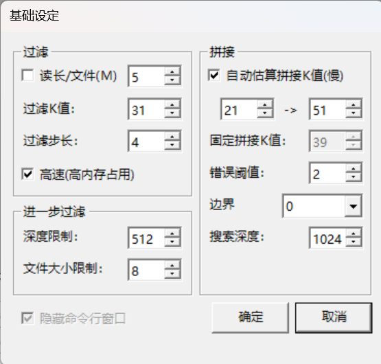

##### **过滤：**

    - 读长/文件(M): 启用此选项将只使用测序数据的一部分（单位为M reads）。在分析高拷贝数基因（如细胞器基因）时，无需使用整个数据集。启用此选项可以显著提高分析速度。但在测序深度低或处理低拷贝数基因的情况下，建议关闭此选项。 

    - 过滤K值: 过滤K值（kf）的设定取决于三个因素：目标基因相关reads的获取率（p）、reads的长度（r）以及参考与目标序列之间的变异程度（v）。通常，当p为0.99，r为150，v为0.1时，kf约为31，这是我们的默认设置。如果p为0.95且v增加到0.2（r保持在150），kf降至17，这是建议的最低阈值。 

    - 过滤步长: 设置过滤过程的间隔碱基数。增加此值可以加速过滤过程，但也会降低reads的恢复率。在测序深度很低或参考序列与目标序列差异较大的情况下，建议将此值减少到1，否则保留默认设置。

例如: 当过滤K值为7，步长为1时，对reads的切割方式如下所示:

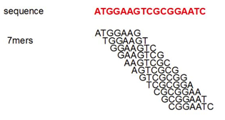

    - 高速(高内存占用): 启用此选项将大部分数据存储在内存中，而不是实时计算。相对于禁用该选项可以使处理速度几乎加倍，但RAM的使用量也会加倍。

##### **进一步过滤：**

    - 深度限制: 当软件处理大量的过滤数据时，它会启动二次过滤过程。这个过程旨在提高序列组装的效率和精度。当读取长度和读取次数的乘积除以参考平均长度超过此值时，GeneMiner2会每次将过滤K值（kf）增加2，上限为63。

    - 文件大小限制: 当软件处理大量的过滤数据时，它会启动二次过滤过程。这个过程旨在提高序列组装的效率和精度。当过滤文件的大小超过此值时（以MB计量），GeneMiner2会每次将过滤K值（kf）增加2，上限为63。

##### **拼接：**

    -自动估算拼接值(慢): 选择此选项允许程序根据reads与参考序列之间的重叠程度自动估算最大可行的组装K-mer（ka）值。较大的ka值可以提高结果的准确性，但可能会影响结果完整性。激活此选项将显著降低组装过程的速度。

    -固定拼接K值: 使用固定的K-mer（ka）值进行序列组装。

    -错误阈值: 错误阈值是用来评估当前拼接的序列在过滤后的 reads（filtered reads）中出现次数的标准。随着拼接的进行，序列变得越长，可能会遇到更多的变异位点，这会导致匹配的序列数量减少。如果当前拼接序列的出现次数低于设定的错误阈值，工具会停止组装。需要注意的是，设置更高的错误阈值会提高组装结果的准确性，但可能限制组装序列的长度。建议默认值。如果序列数量较少可以将其调低。

    -边界：在GeneMiner2中，软边界是目标序列恢复期间序列边缘之外的最大扩展。'auto'将此限制为reads长度的一半。将其设置为'0'将禁用它，而'unlimited'不会施加边界长度限制。

    -搜索深度：此选项指定在组装期间保留的候选序列的最大数量，通常无需修改。对于长度超过5k的目标序列，可以设置更高的值。

**[分析>基于参考切齐]**：根据参考序列来源使用BLAST切除两段低质量序列，并根据设定阈值对筛选序列。当测序和参考序列来源不同时(例如使用基因组数据与转录组参考)，建议将该值设置为0以防止过度过滤；当来源相同，建议选择默认值50%。切齐后的结果保存在'blast'文件夹。当测序序列深度低并且想获得较多长度较长的序列，建议选择all fragments算法切齐；当测序序列深度较高，且参考序列数量较多，建议采用trim terminal切齐算法。如基因组存在旁系同源或转录组存在选择性剪切的情况，“longest fragments”模式可以保留所有参考序列对应的最长匹配结果。

**[分析>迭代>运行迭代]**: 将输出目录中contigs_all中的序列作为参考序列，重新执行所有的过滤和拼接过程。结果保存在输出目录的iteration文件夹中。可以增强序列的长度和精度，建议运行。

**[分析>迭代>用迭代覆盖]**: 将results中的结果文件替换为迭代后的结果文件。

**[分析>迭代>多次迭代]**: 多次进行迭代操作以增强序列的长度和精度。

**[分析>获取最佳参考序列]**: 将reads分割成kmer与参考序列kmer哈希表进行比对。当一个目标基因存在多个参考序列，将选择匹配kmer最多的参考作为最佳参考序列。结果储存在best_refs.

**[分析>一致性重构]**: 将结果序列和过滤后的fq文件进行映射。按照提示进行阈值设定，提高阈值会增加模糊碱基的数量，如果想区分混杂序列建议选择默认（0.75），如果想得到无简并碱基的结果建议选择0.25。

**[分析>多拷贝检测]**: 对results中单个物种的基因序列进行映射，筛选杂合位点，进行多拷贝基因的检测。

**[分析>植物叶绿体基因组]**: GeneMiner2调用NOVOPlasty进行细胞器基因组组装，软件提供近源物种的叶绿体基因组序列下载作为参考序列并选用其中近源的作为种子序列，可以解决叶绿体重复区域的倒转重复问题；之后载入数据文件，即可进行叶绿体基因组的组装。通常保持默认参数即可。要进行更加细致的默认参数设定，可以手动编辑应用程序包analysis目录下的NOVO_config.txt文件，修改时请勿删除$及其之间的内容。点击确定按钮开始运行，所有结果将保存在输出目录的Organelle文件夹中。

**[分析>植物线粒体基因组]**: GeneMiner2调用NOVOPlasty进行细胞器基因组组装，**需要选中先前拼接的叶绿体基因组**，再载入数据文件，即可进行线粒体基因组的组装。软件提供近源物种的线粒体基因组序列下载作为参考序列，可以解决线粒体重复区域的倒转重复问题。要进行更加细致的默认参数设定，可以手动编辑应用程序包analysis目录下的NOVO_config.txt文件，修改时请勿删除$及其之间的内容。点击确定按钮开始运行，所有结果保存在输出目录的Organelle文件夹中。

**[分析>动物线粒体基因组]**: GeneMiner2调用NOVOPlasty进行细胞器基因组组装，软件提供近源物种的线粒体基因组序列下载作为参考序列并选用其中近源的作为种子序列；之后载入数据文件，即可进行叶绿体基因组的组装。

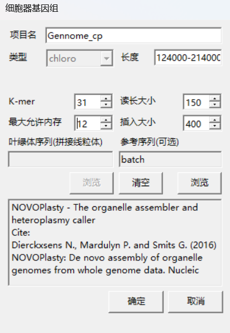

NOVOPlasty参数具体含义详见[NOVOPlasty Github](https://github.com/ndierckx/NOVOPlasty)。

**[分析>获取单拷贝基因]**:需要导入转录本数据作为参考序列，对导入的转录本进行单拷贝基因的提取，后续将作为参考序列用于浅层序列单拷贝基因提取。

---

### 批量菜单

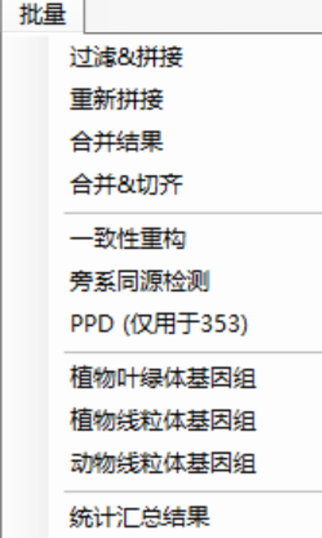

**[批量>过滤&拼接]**：对选中的不同物种的测序文件进行批量分析，使用当前设定的参数自动完成过滤、（进一步过滤）、拼接的全部步骤，所有结果以测序文件名命名保存在输出目录。

**[批量>重新拼接]**：对选中的不同物种的测序文件进行批量分析，使用当前设定的参数重新进行拼接。

**[分析>基于参考切齐]**：根据参考序列来源使用BLAST切除两段低质量序列，并根据设定阈值对筛选序列。当测序和参考序列来源不同时(例如使用基因组数据与转录组参考)，建议将该值设置为0以防止过度过滤。当来源相同，建议选择默认值50%。切齐后的结果保存在'blast'文件夹。切齐算法选择方式：all fragments：测序序列深度低并且想获得较多长度较长的序列；trim terminal：当测序序列深度较高，且参考序列数量较多；longest fragments：结果包含旁系同源基因，或仅想保留参考序列中对应的最长匹配结果。

**[批量>合并结果]**：将批量分析的结果合并，并对合并后的fasta文件进行多序列比对并切齐。不同物种、同一基因的分析结果将合并在一个fasta文件中。

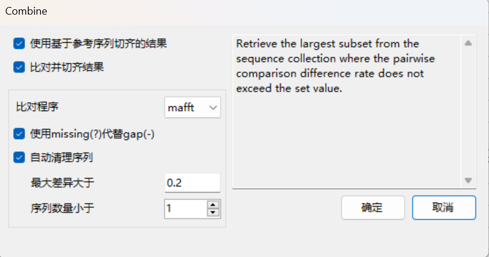

**[批量>构建系统发育树]**：基于合并结果构建系统发育树，一般流程为：导入参考和测序序列、过滤拼接、基于参考切齐、合并结果、构建系统发育树。可选择构建串联/并联树，支持构建有根树并选择外类群。

**[批量>一致性重构]**：将勾选物种过滤后的fq文件批量与结果序列进行映射。按照提示进行阈值设定，提高阈值会增加模糊碱基的数量。

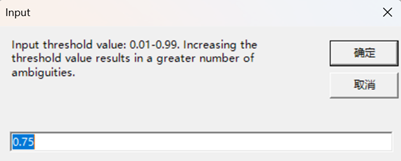

阈值设定等细节[分析菜单]

**[批量>多拷贝检测]**: 对每个物种的提取的结果序列进行多拷贝基因的检测。

**[批量>旁系同源检测（PPD）]**：**注意，一致性重构之后才可进行PPD**，即进行[过滤&拼接]提取结果的旁系同源检测。需要输入外类群的测序文件所在的ID号。得到的结果是旁系同源基因。

 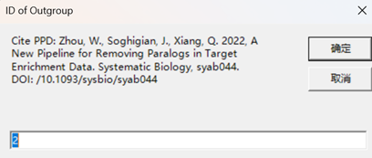

**[批量>植物叶绿体基因组]**：对选中的植物不同物种的测序文件进行批量叶绿体基因组拼接。

**[批量>植物线粒体基因组]**：对选中的植物不同物种的测序文件进行批量线粒体基因组拼接。**需要提供组装的叶绿体基因组。**

**[批量>动物线粒体基因组]**：对选中的动物不同物种的测序文件进行批量线粒体基因组拼接。

详见[分析菜单]

**[批量>统计汇总结果]**：汇总过滤、拼接、多拷贝检测的结果。    Result Availability：是否存在组装结果，1为是。Multicopy Presence：是否存在多拷贝序列。1为是。具体说明见[output.md].

---
### Tools

**[计算参数]**：使用参考序列批量过滤测序数据，提取与目标基因相关的 reads。

**[拆分过滤文件]**：将过滤后的文件拆分为双端 reads，结果保存在 filtered 文件夹中。

**[结果加入参考-比对/切齐]**：将组装结果与参考序列比对。结果保存在 aligned 或 trimmed 文件夹中。可选择仅对末端（terminal）进行切齐，或对整个序列进行切齐。

**[参考序列切片]**：选择需切片的参考序列，GeneMiner2 会将其切割为有重叠的小片段，以提升比对灵活性与敏感性。输入格式为：片段长度,重叠长度（例如：300,150 表示每个片段长度为 300bp，相邻片段重叠 150bp）。切片后的序列将直接作为参考导入，如需保存可通过菜单 “File → Export Reference” 导出到指定文件夹。
什么时候建议使用切片？
    - 样本与参考差异较大（如不同物种或品种）
    - 参考序列为转录本或包含内含子
    - 测序深度低，匹配片段零散或不连续
  
**[合并参考序列-按照序列名合并/直接合并]**：将参考序列合并。

**[参考序列建树]**：基于导入的参考序列构建系统发育树。

**[修订树时间]**：对指定的树文件进行分化时间标定。

**[整理树格式]**：导入树中物种名称设置。

## 参考文献

ZHANG Z, XIE P, GUO Y, et al. Easy353: A Tool to Get Angiosperms353 Genes for Phylogenomic Research [J]. Mol Biol Evol, 2022, 39(12).

XIE P, GUO Y, TENG Y, et al. GeneMiner: A tool for extracting phylogenetic markers from next-generation sequencing data [J]. Mol Ecol Resour, 2024, 24(3): e13924.

LIU C, TANG Z, LI L, et al. Enhancing antimicrobial resistance detection with MetaGeneMiner: Targeted gene extraction from metagenomes [J]. Chin Med J (Engl), 2024, 137(17): 2092-8.

DIERCKXSENS N, MARDULYN P, SMITS G. NOVOPlasty: de novo assembly of organelle genomes from whole genome data [J]. Nucleic Acids Res, 2017, 45(4): e18.

Wenbin Z,John S,Jenny Q X. A New Pipeline for Removing Paralogs in Target Enrichment Data.[J]. Systematic biology,2021,71(2).

KATOH K, MISAWA K, KUMA K I, et al. MAFFT: a novel method for rapid multiple sequence alignment based on fast Fourier transform [J]. 2002, 30(14): 3059-66.

EDGAR R C J N C. Muscle5: High-accuracy alignment ensembles enable unbiased assessments of sequence homology and phylogeny [J]. 2022, 13(1): 6968.

CAPELLA-GUTIERREZ S, SILLA-MARTINEZ J M, GABALDON T. trimAl: a tool for automated alignment trimming in large-scale phylogenetic analyses [J]. Bioinformatics, 2009, 25(15): 1972-3.

PRICE M N, DEHAL P S, ARKIN A P. FastTree 2--approximately maximum-likelihood trees for large alignments [J]. PLoS One, 2010, 5(3): e9490.

NGUYEN L T, SCHMIDT H A, VON HAESELER A, et al. IQ-TREE: a fast and effective stochastic algorithm for estimating maximum-likelihood phylogenies [J]. Mol Biol Evol, 2015, 32(1): 268-74.

ZHANG C, RABIEE M, SAYYARI E, et al. ASTRAL-III: polynomial time species tree reconstruction from partially resolved gene trees [J]. BMC Bioinformatics, 2018, 19(Suppl 6): 153.

YANG Z, RANNALA B J M B, EVOLUTION. Bayesian estimation of species divergence times under a molecular clock using multiple fossil calibrations with soft bounds [J]. 2006, 23(1): 212-26.

RANNALA B, YANG Z J S B. Inferring speciation times under an episodic molecular clock [J]. 2007, 56(3): 453-66.

EMMS D M, KELLY S. OrthoFinder: phylogenetic orthology inference for comparative genomics [J]. Genome Biol, 2019, 20(1): 238.

